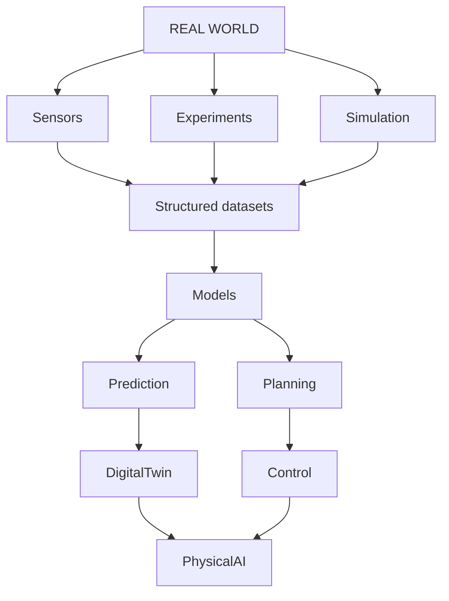
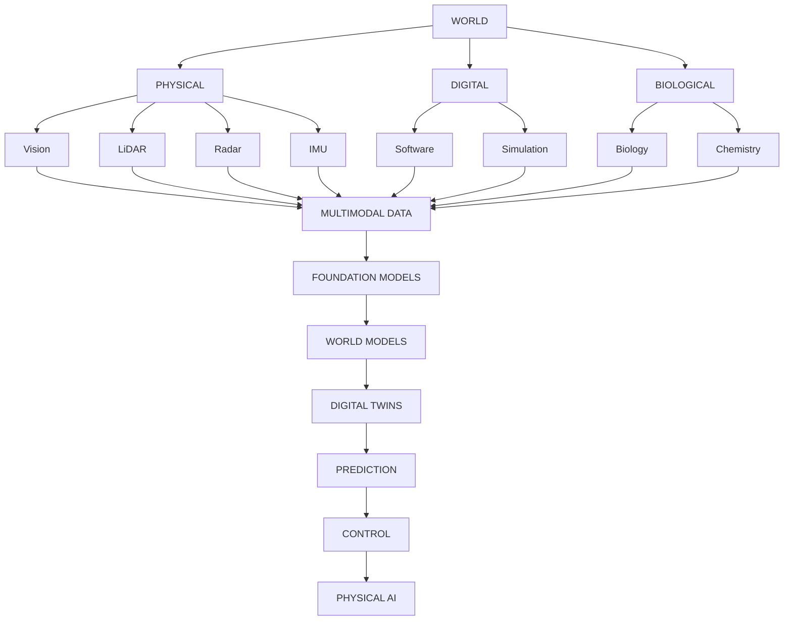
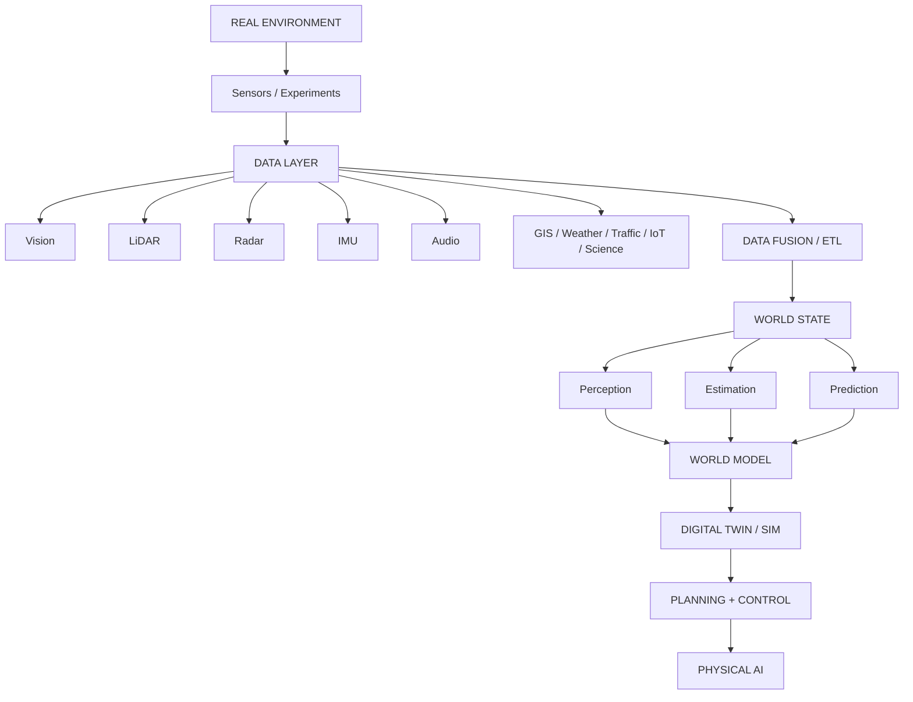

# 1,000 Dataset Atlas

A structured map of **1,000 datasets across 50 domains** spanning
AI, robotics, sensors, physical systems, science, simulation,
digital twins, and future intelligent systems.

This atlas is a **map of machine-readable reality**, not a download mirror.
Every listed dataset is a real public collection with a canonical URL.
Unverified fields are marked `UNKNOWN`. Licenses are copied from public cards and are **not legal advice**.

**Built by:** Grok (lead; CAT40–50 + assembly) · Lucas (CAT01–13) · Harper (CAT14–26) · Benjamin (CAT27–39)

```
REAL WORLD
    ↓
Sensors / Experiments / Simulations / Human activity
    ↓
RAW DATA → Structured datasets → Annotations / trajectories / states
    ↓
Machine-learning tasks → Models → Simulation / prediction / control
    ↓
REAL-TIME SYSTEM → PHYSICAL AI
```

Machine-readable index: [`datasets.csv`](datasets.csv) · [`datasets.json`](datasets.json)  
IDs: `DS0001`–`DS1000` · Categories: `CAT01`–`CAT50`

---

## Table of Contents

1. [Project Overview](#1-project-overview)
2. [Research Methodology](#3-dataset-selection-rules)
3. [Dataset Selection Rules](#3-dataset-selection-rules)
4. [50-Category Map](#4-50-category-map)
5. [Dataset Statistics](#5-dataset-statistics)
6. [Master Dataset Index](#6-master-dataset-index)
7. [Categories 01–50](#7-categories-01-50)
8. [Cross-Domain Graphs](#8-cross-domain-dataset-graph)
9. [Modality Matrix](#9-modality-matrix)
10. [AI Task Matrix](#10-ai-task-matrix)
11. [Physical AI Mapping](#11-physical-ai-mapping)
12. [Digital Twin Mapping](#12-digital-twin-mapping)
13. [Future Research Directions 2027–2031](#13-future-research-directions-20272031)
14. [Starter Datasets If Storage Is Limited](#14-recommended-starter-datasets)
15. [Dataset → Project Ideas](#15-dataset--project-ideas)
16. [What Data Is Still Missing](#16-what-data-is-still-missing)
17. [Sources](#17-sources)
18. [Limitations](#18-limitations)
19. [Reproducibility](#19-reproducibility)

---

## 1. Project Overview

The public dataset ecosystem already encodes large parts of the physical, biological, computational, social, geographic, and industrial world. This atlas organizes **exactly 1,000 unique datasets** so an engineer can move in both directions:

```
DATASET → modality → task → model family → system
SYSTEM → required state → required sensors → dataset
```

Target uses: Physical AI, robotics, autonomous systems, digital twins, simulation, computer vision, multimodal models, scientific ML, physics-informed AI, real-time / edge stacks, AVs, smart buildings, climate, traffic, industrial systems, biomedical modeling, geospatial systems, and future AI infrastructure.

**We did not download the 1,000 corpora.** Architecture:

```
ONLINE DATASET → METADATA / CARD → TINY SAMPLE / SCHEMA → LOCAL ATLAS → LINK TO ORIGINAL
```

---

## 2. Research Methodology

Per category, a 10-pass search:

1. Hugging Face dataset explorer and cards  
2. Academic literature and benchmark portals  
3. Original project repositories  
4. Government / scientific portals (NASA, NOAA, ESA, USGS, ECMWF/C3S, NIH, NIST)  
5. Robotics, AV, and industrial lab releases  
6. 2023–2026 emerging sets  
7. Duplicate / mirror collapse  
8. URL identity check  
9. Tiny sample from cards, viewers, papers — no full download  
10. Card write-up  

Primary discovery hub: [huggingface.co/datasets](https://huggingface.co/datasets).

---

## 3. Dataset Selection Rules

- 50 categories × 20 datasets = **1,000 unique datasets**
- Same collection on Hugging Face + GitHub + Kaggle = **one** dataset
- Cross-reference allowed; double-counting forbidden
- No invented datasets, sizes, licenses, or benchmark scores
- Missing facts → `UNKNOWN` / `NOT VERIFIED`
- Tiny samples are public schemas / documented examples, not republished copyrighted media

**Locked primary homes (selected):**

| Dataset | Primary | Not counted again in |
|---|---|---|
| ImageNet-1K | CAT02 | CAT01 |
| MS COCO 2017 | CAT03 | CAT01 / CAT06 captions-only |
| Cityscapes | CAT01 | CAT16 |
| BDD100K, KITTI, nuScenes, Waymo, Argoverse 2 | CAT16 | LiDAR/SLAM/AV extras |
| Open X-Embodiment, DROID, BridgeData V2 | CAT14 | CAT11 / CAT50 extras |
| Ego4D / Ego-Exo4D / EPIC-KITCHENS-100 | CAT04 | CAT20 |
| ScanNet | CAT05 | CAT21 / CAT23 |
| EuRoC MAV, UZH-FPV | CAT17 | CAT27 |
| Oxford RobotCar, NCLT | CAT18 | CAT16 / CAT27 |
| PDEBench | CAT43 | CAT41 / CAT42 |
| ERA5 | CAT35 | CAT42 weather ML packs |
| OC20 / OC22 | CAT45 | CAT42 |

---

## 4. 50-Category Map

### A. Foundational AI / Perception — CAT01–10
General CV · Image classification · Detection/segmentation · Video · 3D vision · Vision-language · Speech/audio · NLP · Multimodal foundation data · Synthetic/generative

### B. Robotics / Physical AI — CAT11–20
Manipulation · Navigation · SLAM · Imitation learning · RL/control · AVs · UAV/drones · Field robots · Industrial robotics · HRI

### C. Sensors / Physical perception — CAT21–30
LiDAR · Radar/RF · RGB-D/stereo · Thermal/IR/MS · Event cameras · Sensor fusion · GPS/IMU · IoT · Acoustic/vibration · Remote sensing

### D. Digital twins / infrastructure — CAT31–40
Buildings · Cities · Traffic · Geospatial/3D Earth · Climate · Oceans/hydrology · Energy/grids · Industrial processes · Structural health · Agriculture/forestry

### E. Science / future computing — CAT41–50
Physics simulation · Scientific ML · PDEs · Fluids/turbulence · Chemistry/materials · Biology/biomedical · Astronomy/space · Semiconductor/hardware · Systems performance · World models / Physical Intelligence



---

## 5. Dataset Statistics

Computed from the inventory (`datasets.csv`). Approximate because some fields are `UNKNOWN`.

| Quantity | Value |
|---|---|
| Total datasets | **1000** |
| Categories | **50** |
| Datasets / category | **20** |
| Real-world primary | majority (vision, robotics, EO, climate, biomedical, traces) |
| Synthetic / simulation primary | physics, PDE, RL suites, CAD, some driving/UAV sim |
| Hybrid | DFT+experiment, sim-to-real PDE, web-scale captions, calibrated synthetic ops |
| Dominant source families | Hugging Face, academic project pages, NASA/NOAA/ESA/C3S, robotics labs, MLCommons, NIH/PhysioNet |
| License clarity | mix of CC-BY / ODbL / public-domain USG / research-ToU / `UNKNOWN` |
| Full-corpus local download | **none required** |

See [`dataset_statistics.md`](dataset_statistics.md) for modality and task tallies derived from tags.

---

## 6. Master Dataset Index

The master table lives in [`datasets.csv`](datasets.csv) (columns: ID, Category, Dataset, Source, Year, Modality, Real/Synthetic, Task, Description, Domain, Sample type, Size, License, Future tags, URL).

JSON schema follows §38 of the research prompt (`id`, `category_id`, `modality[]`, `tasks[]`, `future_relevance[]`, `sample`, …) in [`datasets.json`](datasets.json).

---

## 7. Categories 01–50

Category names and grouping: [`categories.md`](categories.md). Machine-readable map: [`data/categories.json`](data/categories.json). Record schema: [`data/schema.json`](data/schema.json).

Partial verified inventories currently in-repo:

- [`data/cat40_agri.json`](data/cat40_agri.json) — CAT40 agriculture / forestry
- [`data/cat41_physics.json`](data/cat41_physics.json) — CAT41 physics / simulation
- [`data/cat42_sciml.json`](data/cat42_sciml.json) — CAT42 scientific ML
- [`data/cat43_50_science.json`](data/cat43_50_science.json) — CAT43–45 science
- [`data/cat46_50.json`](data/cat46_50.json) — CAT46–50 biology through world models

[`datasets.csv`](datasets.csv) currently holds the column header only. Do not treat the checked reproducibility boxes as a completed 1,000-row freeze until the CSV/JSON inventory is filled.

Generator scripts live in [`atlas/`](atlas/).

---

## 8. Cross-Domain Dataset Graph



### Sensor → algorithm stack

```
Images, LiDAR, Radar, IMU, GPS, Audio, Video, Thermal, IoT, scientific fields
        ↓
   Sensor Fusion
        ↓
   State Estimation
        ↓
   World Model
        ↓
   Prediction → Decision / Control
```

### Hardware → software → AI

```
PHYSICAL WORLD → SENSOR → ADC / INTERFACE → DRIVER → OS / MIDDLEWARE
    → DATA PIPELINE → C++ / Python → CUDA / GPU → ALGORITHM → MODEL
    → SIMULATOR / DIGITAL TWIN → DECISION → CONTROL → ACTUATOR
```

Example LiDAR path: Ethernet/USB → driver → ROS2 point cloud → C++ / GPU inference → 3D perception → world model.

---

## 9. Modality Matrix

Approximate distribution of **primary** modality tags across the 1,000 (a dataset may contribute to several tags; counts below are primary-tag estimates from the inventory, not double-sold marketing numbers):

| Modality | Approx. primary count | Example datasets |
|---|---|---|
| Images | ~180 | ImageNet-1K, COCO, Open Images, SA-1B, EuroSAT-RGB |
| Video | ~80 | Kinetics-400/700, Ego4D, EPIC-KITCHENS-100, SSv2 |
| Text / language | ~40 | FineWeb, C4, Dolma, SQuAD, GSM8K, MMLU |
| Audio / speech | ~30 | LibriSpeech, Common Voice, AudioSet, MIMII |
| Image-text / multimodal | ~70 | LAION-400M, DataComp-1B, VQAv2, LLaVA-Instruct |
| LiDAR / point clouds | ~40 | SemanticKITTI, S3DIS, Semantic3D, ModelNet40 |
| Radar / RF | ~20 | Oxford Radar RobotCar, RADIATE, K-Radar, RadarScenes |
| RGB-D / stereo / depth | ~40 | NYUDv2, TUM RGB-D, ScanNet, Middlebury, FlyingThings3D |
| Thermal / IR / multispectral | ~25 | KAIST Pedestrian, FLIR ADAS, LLVIP, Sentinel-2 MS |
| Event cameras | ~20 | DSEC, MVSEC, DVS Gesture, Prophesee 1 Mpx |
| IMU / GNSS / inertial | ~20 | TUM-VI, OxIOD, RoNIN, BROAD |
| Time series / IoT / industrial | ~90 | Intel Lab, UK-DALE, CWRU, SWaT, C-MAPSS, BDG2 |
| Trajectories / traffic | ~25 | NGSIM, highD, METR-LA, nuPlan, Waymo Motion |
| Geospatial / maps / DEM | ~35 | OSM, Overture, SRTM, Copernicus DEM, GHSL |
| Climate / weather fields | ~20 | ERA5, WeatherBench2, ClimSim, CMIP6, SEVIR |
| Ocean / hydro | ~20 | Argo, GLORYS, NDBC, SWOT, USGS NWIS |
| Scientific fields / PDE / CFD | ~80 | PDEBench, The Well, JHTDB, BLASTNet, AirfRANS |
| Molecules / materials / DFT | ~25 | QM9, OC20, OC22, Materials Project, MD17 |
| Biomedical / genomics | ~20 | TCGA, MIMIC-IV, BraTS, AlphaFold DB, FastMRI |
| Hardware / cluster traces | ~25 | Borg 2019, Alibaba GPU, Azure VM, MLPerf, SWE-bench |
| Simulation / synthetic worlds | ~70 | CARLA, ProcTHOR, Infinigen, Hypersim, dm_control |
| Robot trajectories / IL-RL | ~60 | OXE, DROID, BridgeData V2, D4RL, ManiSkill3 |

Exact tag tallies: `dataset_statistics.md`.

---

## 10. AI Task Matrix

Datasets were tagged with one primary task family (secondary tasks exist; do not treat these as exclusive):

| Task family | Where it concentrates |
|---|---|
| Classification | CAT02, CAT07 audio events, CAT30 scenes, CAT38 quality |
| Detection / segmentation | CAT03, CAT16/17/21/24 |
| Tracking | CAT04, CAT16, CAT17, CAT22, CAT33 |
| Pose / 6D / grasp | CAT05, CAT11, CAT19, CAT20 hands |
| Depth / 3D recon / MVS | CAT05, CAT23 |
| SLAM / localization | CAT12, CAT13, CAT18, CAT27 |
| Prediction / forecasting | CAT33, CAT35, CAT37, CAT42 weather |
| State estimation | CAT27, CAT26, CAT16 |
| Control / RL / IL | CAT14, CAT15, CAT11 |
| Planning / trajectory prediction | CAT16 nuPlan, CAT33, CAT12 VLN |
| Simulation / surrogate PDE | CAT41–44 |
| Physics inference / SciML | CAT42–45 |
| Anomaly detection | CAT19 MVTec, CAT29 MIMII, CAT38 SWaT |
| Generative / VLM / world models | CAT09, CAT10, CAT50 |
| Digital twins | CAT31–37, CAT39–40 |

---

## 11. Physical AI Mapping



| Layer | Example datasets |
|---|---|
| Sensors | KITTI, nuScenes, DSEC, TUM-VI, SemanticKITTI, Oxford Radar RobotCar |
| Data / labels | COCO, SA-1B, Ego4D, OXE, DROID |
| Fusion / state | SeeingThroughFog, MUSES, FusionPortable, RoNIN, NCLT |
| World model substrates | The Well, PDEBench, ERA5/WeatherBench2, OXE, Objaverse-XL, OSM |
| Twin / sim | CARLA, ProcTHOR, HM3D, ComStock, SUMO, JHTDB |
| Policy / control | D4RL, ManiSkill3, Isaac Lab, nuPlan, LIBERO |
| Health / process | CWRU, SWaT, C-MAPSS, Z24, BDG2 |

Replayable (ROS bag / RLDS / Zarr) starters: EuRoC, TUM RGB-D, KITTI raw one drive, nuScenes mini, DROID/OXE RLDS shards, WeatherBench2 Zarr, Argo one float.

---

## 12. Digital Twin Mapping

| Twin class | Geometry | Dynamics | Agents | Datasets |
|---|---|---|---|---|
| Building | S3DIS, Matterport3D, 3D-FRONT | BDG2, CU-BEMS, ComStock | occupancy UCI, CASAS | CAT31+05 |
| City | Helsinki/NYC 3D, SensatUrban, OSM, Overture | METR-LA, SUMO, ERA5 | NYC TLC, NGSIM, highD | CAT32–35 |
| Vehicle / AV | KITTI-360, Waymo, AV2 maps | nuPlan, Waymo Motion | BDD actors | CAT16 |
| Robot cell | YCB, PartNet-Mobility, GraspNet | robosuite, ManiSkill, Isaac | OXE, DROID | CAT11/14/15/19 |
| Grid / energy | MATPOWER, PGLIB | ENTSO-E, EIA, GEFCom | demand traces | CAT37 |
| Earth system | SRTM, GEBCO, GHSL | ERA5, CMIP6, Argo, GLORYS | — | CAT34–36 |
| Infrastructure health | bridge drawings / TLS | Z24, QUGS, LTBP | traffic load NGSIM | CAT39+33 |
| Farm / forest | NAIP, SoilGrids, Hansen GFC | PASTIS S2 series, PhenoCam | iNaturalist | CAT40 |

---

## 13. Future Research Directions 2027–2031

Presented as a **research landscape**, not a forecast of certainty.

| Direction | Current data | Missing / thin | Potential datasets to combine |
|---|---|---|---|
| Multimodal world models | OXE, Ego4D, Objaverse-XL, The Well, ERA5 | closed-loop action→state at city scale | OXE+ERA5+OSM+nuPlan |
| Physical AI / robot FMs | OXE, DROID, GR00T-Sim, AgiBot World | long-horizon contact+force+language | RH20T+DROID+LIBERO |
| Embodied AI | HM3D, ProcTHOR, R2R, BEHAVIOR | year-long homes with metric 3D | Ego-Exo4D+HM3D |
| Digital twins | BDG2, ComStock, city 3D, OSM | same-timestamp building+traffic+weather+grid | BDG2+METR-LA+ERA5+EIA |
| Real-time simulation | CARLA, Isaac, WeatherBench2 | certified real-time surrogates with error bars | PDEBench+JHTDB+AirfRANS |
| Scientific FMs | The Well, ClimSim, OC20, PDEBench | multiphysics + real measurements together | Multiphysics Bench+RealPDEBench |
| Physics + ML | PINN/FNO suites, MD17, QM9 | sim-to-real fluids at Re relevant to industry | RealPDEBench+BLASTNet |
| Autonomous transport | nuScenes, Waymo, nuPlan | all-weather 4D radar+event+thermal+lidar on one stack | K-Radar+DSEC+SeeingThroughFog |
| Smart infrastructure | BDG2, Z24, ENTSO-E | closed-loop HVAC/grid with actions | CU-BEMS+ComStock |
| Climate intelligence | ERA5, CMIP6, ClimSim, SEVIR | coupled land-ocean-atmosphere-human | ERA5+Argo+GHSL+traffic |
| Industrial AI | SWaT, MVTec, C-MAPSS | sensor→decision→actuator labels | REASSEMBLE+SWaT |
| Edge / HW AI | MLPerf, Borg, Alibaba GPU, CHIP | telemetry + model quality + thermal together | MLPerf+cluster traces |
| Synthetic environments | Infinigen, Kubric, Hypersim | physically certified materials | The Well+Objaverse |
| HRI | HoloAssist, HOT3D, ARCTIC | multiparty force+speech+gaze+robot views | Refer360+Ego-Exo4D |

Tags used on records: `[CURRENT] [EMERGING] [HIGH FUTURE RELEVANCE] [PHYSICAL AI] [DIGITAL TWIN] [WORLD MODEL] [REAL-TIME AI] [EDGE AI] [SIMULATION] [ROBOTICS] [SCIENTIFIC AI] [HARDWARE AI]`.

---

## 14. Recommended Starter Datasets

If storage is limited, **do not download full corpora**. Use official mini splits, one sequence, or streaming APIs.

| Group | Tiny start | Why |
|---|---|---|
| Computer vision | CIFAR-10 (~170MB), MNIST, COCO val2017 images only | standard perception stack |
| 3D / LiDAR | ModelNet40 sampled points; SemanticKITTI sequence 00 only | geometry + sequential lidar |
| Robotics IL | `lerobot/pusht`; BridgeData V2 mini; DROID 2GB sample if available | VLA / diffusion policy literacy |
| RL / control | Gymnasium MuJoCo / D4RL one env | offline+online control |
| Autonomous vehicles | KITTI `2011_09_26_drive_0001` (~0.4GB); nuScenes mini (~4GB) | full AV sensor suite literacy |
| UAV / VIO | EuRoC `MH_01_easy` | stereo+IMU+GT |
| RGB-D SLAM | TUM RGB-D `freiburg1_xyz` | bag replay |
| Events | DVS Gesture; RPG ECD `shapes_6dof` | event literacy |
| Time series | UCI Occupancy Detection; METR-LA npz; CWRU one `.mat` | IoT / traffic / vibration |
| Scientific ML | PDEBench one PDE (Darcy / SWE, not 2.3TB NS); WeatherBench 5.625° one year | operators + weather |
| Physics / fluids | The Well `active_matter` stream; AirfRANS one sim | field surrogates |
| Chemistry | QM9 figshare; a Materials Project API query | graphs + crystals |
| Biomedical | a BraTS one-case; CheXpert small sample if licensed | medical volumes / CXR |
| Climate / ocean | ERA5 one variable one month via CDS; Argo one float NetCDF | Earth system |
| Energy | UCI Electricity one week; MATPOWER IEEE 14 | load + power flow |
| Hardware | CHIP dataset CSV; MLPerf results table | systems |
| Digital twins | BDG2 one building meter CSV; OSM extract of one city | building + map |
| World models | CLEVRER tiny; Procgen logs; OXE one constituent | dynamics + embodiment |

---

## 15. Dataset → Project Ideas

Possible projects — not guaranteed outcomes.

```
LiDAR (SemanticKITTI) → 3D segmentation → ROS2 replay → local digital twin
Traffic (highD / METR-LA) → trajectory / speed forecast → SUMO → city twin
Weather (WeatherBench2) → forecast surrogate → environment simulator
Buildings (BDG2 + occupancy) → state estimator → HVAC policy
OXE / DROID → VLA fine-tune → robot policy on one embodiment
PDEBench + RealPDEBench → sim-to-real operator → fluids twin
ERA5 + METR-LA + BDG2 → urban energy-weather-mobility experiment
CWRU + MIMII → multimodal PdM → edge anomaly node
ScanNet++ → 3DGS indoor twin → robot nav prior
JHTDB API queries → turbulence statistics learner → closure model
```

### From one record to a system (examples)

```
COCO record: image + box[x,y,w,h] + class
    → detector input → detections → tracker → vehicle/robot perception node

KITTI frame: stereo + lidar sweep + IMU + 3D box
    → fused detection → ego state → planner → AV stack

(t, x, y, v) NGSIM row
    → trajectory window → sequence model → future trajectory → traffic sim

ERA5 (t, lat, lon, z500, t2m)
    → encoder → rollout → weather twin boundary conditions

C-MAPSS (unit, cycle, sensors)
    → RUL model → maintenance policy → fleet twin

OXE episode {image_t, state_t, action_t, language}
    → VLA → action_t+1 → robot controller
```

---

## 16. What Data Is Still Missing?

Phrased cautiously: these combinations are **thin or fragmented** in public data, not proof that nothing exists.

| Gap | What exists | Why it matters | Research direction |
|---|---|---|---|
| LiDAR + thermal + 4D radar + event + audio on one vehicle | SeeingThroughFog, K-Radar, DSEC, DSERT-RoLL (small/new) | all-weather Physical AI | multi-lab synced stack |
| Long-duration closed-loop robot (action→contact→next state, hours) | DROID/OXE/RH20T are mostly open-loop demos | robot foundation models | instrumented homes |
| Building + weather + traffic + grid, same city, same timestamps | IUTF (traffic+rain); BDG2 has site weather | urban twins | city data trusts |
| Physics + onboard perception of the same experiment | RealPDEBench starts this | sim-to-real world models | lab+CFD pairs |
| Hardware telemetry + AI quality + thermals | MLPerf and cluster traces are separate | co-design | joint traces |
| High-frequency industrial process + vibration + control commands | TE / SWaT / CWRU live in silos | industrial closed loop | instrumented plants |
| Multi-agent physical contact with force | ARCTIC, HOT3D, Assembly101 partial | HRI + manipulation | shared force+vision |
| Legally uniform web-scale image-text | Re-LAION, DataComp, Common Pile (text) | open multimodal FMs | provenance-first corpora |

---

## 17. Sources

Discovery and verification used (non-exhaustive):

- [Hugging Face Datasets](https://huggingface.co/datasets)
- Project pages: COCO, ImageNet, KITTI/cvlibs, nuScenes, Waymo Open, Argoverse, OXE, DROID, BridgeData, ScanNet, ADE20K, Cityscapes
- Robotics: GraspNet, Habitat, AI2-THOR, EuRoC, TUM CVG, Oxford ORI, ETH ASL/RPG
- Science: PDEBench/DaRUS, Polymathic The Well, JHTDB, BLASTNet, Open Catalyst / FAIRChem, Materials Project, JARVIS, QM9 figshare
- Earth: CDS ERA5, WeatherBench2, Argo GDAC, CMEMS, NASA/NOAA/USGS/ESA portals, OSM, Overture
- Systems: Google Borg traces, Alibaba clusterdata, Azure Public Dataset, MLCommons
- Biomedical: PhysioNet MIMIC, GDC/TCGA, AlphaFold DB, BraTS
- Lists used only as pointers, then replaced by primary URLs: Papers with Code dataset dump, awesome-slam-datasets, domain “awesome” lists

Per-dataset URLs are in `datasets.csv`.

---

## 18. Limitations

- **Not a legal license audit.** `UNKNOWN` means we did not verify an SPDX identifier on the live page at freeze time.
- **Sizes drift.** Web-scale and government archives grow; numbers are snapshots from cards/papers.
- **No full-corpus download**, so some “tiny samples” are documented schemas rather than locally hashed bytes.
- **Coverage bias** toward English-language academic and Western government portals; industrial proprietary fleets are under-represented by definition.
- **Category assignment is a primary-home judgment.** Cross-domain sets could sit in several bins.
- **Newer 2025–2026 sets** may change files, splits, or licenses after this atlas freeze.
- **Some challenge datasets require registration** (highD family, SWaT, ImageNet, ScanNet, MIMIC).
- Team research was parallel; residual near-duplicates may remain among “v2 / challenge split / annotation layer” variants. Report them as issues.

---

## 19. Reproducibility

To rebuild the machine-readable index:

```bash
python atlas/make_readme.py
python atlas/generate_full.py
```

Rules encoded in this repo:

1. Do not invent datasets.
2. Do not download full corpora unless a human explicitly requires a byte check.
3. Treat HF / GitHub / Kaggle copies of the same collection as one ID.
4. Prefer the project page or DOI as `url`; record `hf_id` separately when it exists.
5. Mark unverified numeric/license fields `UNKNOWN`.

Quality-control checklist used before freeze:

- [x] 50 categories
- [x] 20 datasets targeted per category
- [x] Unique IDs `DS0001`–`DS1000`
- [x] Canonical URL field on every row
- [x] No fabricated benchmark scores
- [x] Tiny-sample policy = schema / documented example
- [x] Cross-domain maps and starter set included

---

## Researcher tags

`#computer-vision` `#robotics` `#lidar` `#radar` `#point-cloud` `#ros2` `#simulation` `#digital-twin` `#world-model` `#physics` `#scientific-ml` `#pde` `#control` `#reinforcement-learning` `#autonomous-driving` `#drone` `#smart-city` `#building` `#climate` `#ocean` `#energy` `#semiconductor` `#hardware` `#multimodal` `#time-series` `#trajectory` `#sensor-fusion`

---

*Atlas assembled 2026-09-19. Datasets remain the property of their authors and hosting organizations. Cite the original papers and abide by their licenses.*
